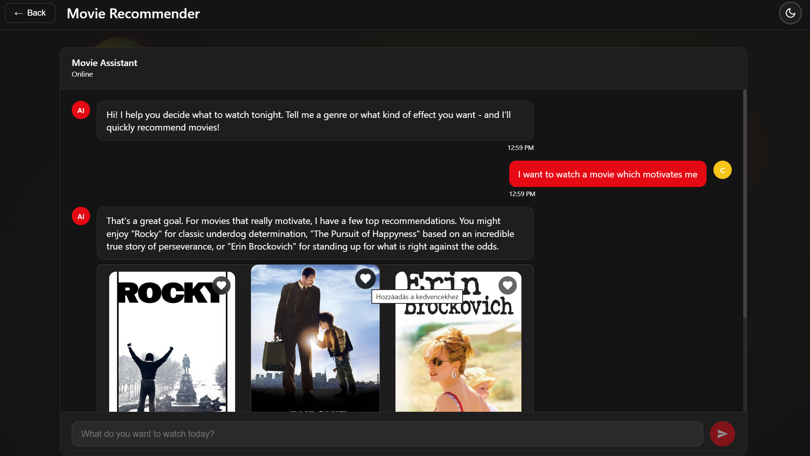
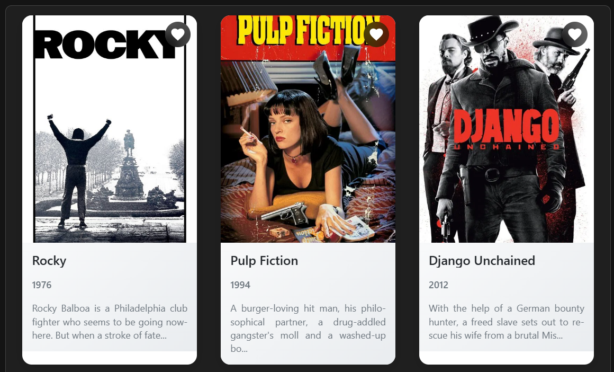
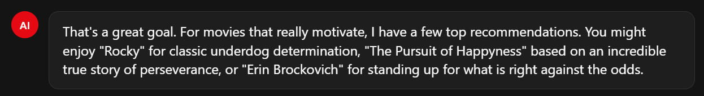
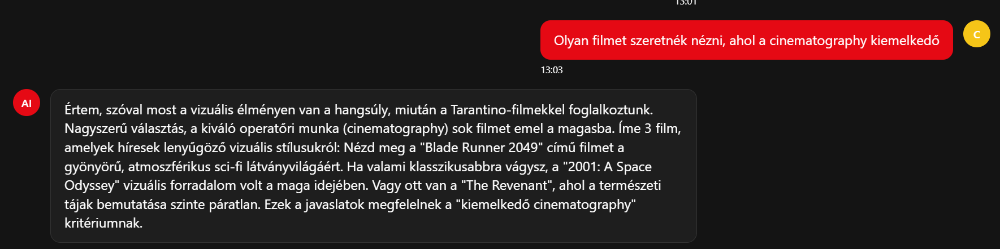
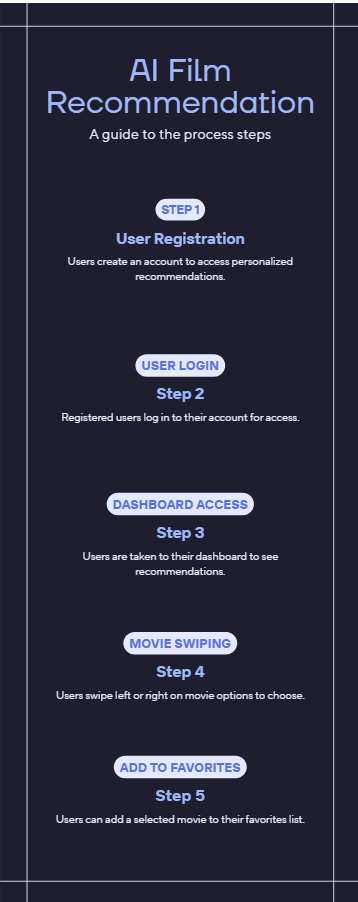

# AI Film Ajánló Chat

## Áttekintés

Az AI film ajánló egy beszélgetés alapú rendszer, amely Google Gemini mesterséges intelligenciát használ filmajánlások generálására. A felhasználó természetes nyelven kommunikálhat az AI asszisztenssel, leírhatja a hangulatát, preferenciáit vagy bármilyen szempontot, és az AI releváns filmeket ajánl neki.

## Főbb Funkciók

### Természetes Nyelvi Beszélgetés

A felhasználó szabadon kommunikálhat az AI-val:

- Hangulat alapú keresés - "Valami motiváló filmet szeretnék nézni"
- Műfaj alapú keresés - "Sci-fi filmeket keresek"
- Kontextuális beszélgetés - Az AI emlékezik a korábbi üzenetekre
- Többnyelvű támogatás - Magyar és angol nyelven egyaránt működik

### Intelligens Filmajánlás

Az AI azonnal reagál és ajánlásokat tesz:

- 2-3 film ajánlása egyszerre
- Rövid, tömör indoklás minden filmhez
- Gyors válaszidő
- Adaptálódás a felhasználó visszajelzéseire



### Interaktív Film Kártyák

Az ajánlott filmek automatikusan film kártyákként jelennek meg:

- Poster kép megjelenítés
- Részletes film információk
- Kedvencekhez adás lehetőség
- TMDB adatbázis integráció



## Működési Folyamat

### 1. Üzenet Feldolgozás

Amikor a felhasználó küld egy üzenetet:

1. A rendszer validálja az üzenetet
2. Hozzáadja a beszélgetési előzményekhez
3. Elküldi az üzenetet a Gemini API-nak
4. Megjeleníti a "gépelés" indikátort

### 2. AI Válasz Generálás

A Gemini API feldolgozza a kérést:

- Figyelembe veszi a beszélgetési előzményeket
- Elemzi a felhasználó kérését
- Generál egy természetes nyelvű választ
- Film címeket speciális formátumban jelöli meg



### 3. Film Azonosítás

A rendszer kiolvassa a film címeket a válaszból:

- `[MOVIE:Film címe]` formátum keresése
- Film adatok lekérése a TMDB API-ból
- Film kártyák előkészítése megjelenítéshez

### 4. Válasz Megjelenítés

A válasz megjelenik a chat felületen:

- Szöveges válasz az AI-tól
- Film kártyák poszterekkel
- Időbélyeg
- Kedvencekhez adás gomb minden filmnél

## Technikai Implementáció

### Frontend Komponensek

**AIChatView.vue**
- Chat felület kezelése
- Üzenet küldés és fogadás
- Film kártyák megjelenítése
- Beszélgetési előzmények tárolása

**MovieRecommendationCard.vue**
- Film kártya komponens
- Poster megjelenítés
- Kedvencekhez adás funkció
- Film részletek link

### Backend Szolgáltatások

**aiService.js**
- Gemini API kommunikáció
- Prompt generálás
- Válasz feldolgozás
- Hibakezelés és fallback üzenetek

**aiPrompts.js**
- Prompt template készítés
- Beszélgetési kontextus építés
- Film formátum szabályok
- Többnyelvű prompt generálás

**aiConfig.js**
- API kulcs kezelés
- Model konfiguráció
- Timeout beállítások
- Fallback üzenetek

### Film Feldolgozás

**movieService.js**
- TMDB API integráció
- Film adatok lekérése cím alapján
- Film cache kezelés
- Fordítások lekérése

## Prompt Engineering

### Formátum Szabályok

Az AI szigorú formátumot követ:

- Minden film cím `[MOVIE:cím]` formátumban
- Nincs markdown formázás
- Tömör, közvetlen válaszok
- Maximum 2-3 film ajánlása egyszerre

### Beszélgetési Kontextus

Az AI fenntartja a beszélgetés folytonosságát:

- Utolsó 10 üzenet tárolása
- Korábbi témák hivatkozása
- Preferenciák megjegyzése a beszélgetés során
- Természetes folytatás korábbi ajánlásokból

### Többnyelvű Támogatás

A rendszer automatikusan váltja a nyelvet:

- Magyar prompt magyar válaszokhoz
- Angol prompt angol válaszokhoz
- Film címek mindig eredeti nyelven
- Fordítások TMDB-ről



## Felhasználói Élmény

### Chat Felület

Modern, intuitív chat interfész:

- Üzenetek buborékok felhasználó/AI megkülönböztetéssel
- Gépelés indikátor
- Automatikus görgetés új üzenetekhez
- Időbélyegek minden üzenetnél

### Film Kártyák

Vizuálisan vonzó film megjelenítés:

- Nagy poster képek
- Film cím és év
- Kedvenc gomb instant reakcióval
- Klikkelve a film részletes oldalára navigál

### Válaszidő

Optimalizált teljesítmény:

- Gyors API válaszok
- Timeout védelem (15 másodperc)
- Újrapróbálkozási mechanizmus
- Fallback üzenetek hiba esetén

## Hibakezelés

### API Hibák

Többszintű védelem:

- 3 újrapróbálkozási kísérlet
- Timeout védelem
- Részletes hibaüzenetek
- Felhasználóbarát fallback válaszok


## Használt API-k

### Google Gemini API

**Model:** gemini-flash-lite-latest

**Endpoint:** `https://generativelanguage.googleapis.com/v1beta/models/gemini-flash-lite-latest:generateContent`

**Funkciók:**
- Természetes nyelvi feldolgozás
- Kontextus alapú válaszok
- Gyors válaszidő
- Költséghatékony

### TMDB API

**Film Keresés:** `/search/movie`

**Funkciók:**
- Film adatok lekérése cím alapján
- Poster képek URL-ek
- Értékelések és népszerűség
- Fordítások lekérése

## Környezeti Változók

Szükséges konfiguráció:

```
VITE_GEMINI_API_KEY=your_api_key
VITE_TMDB_API_KEY=your_tmdb_key
```
## Use case:

