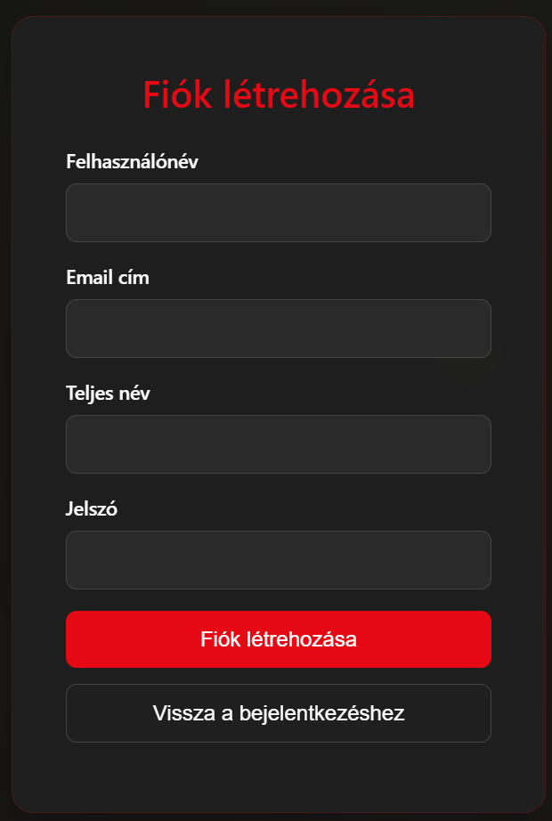
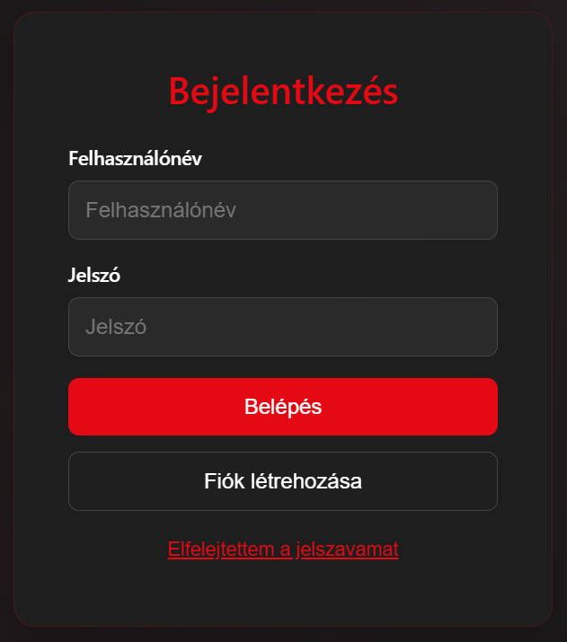
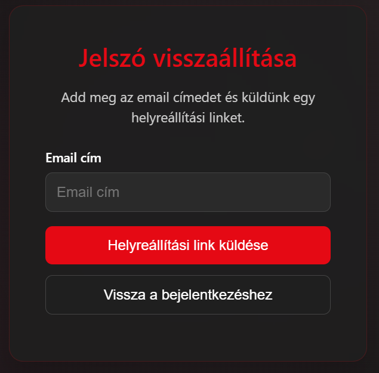
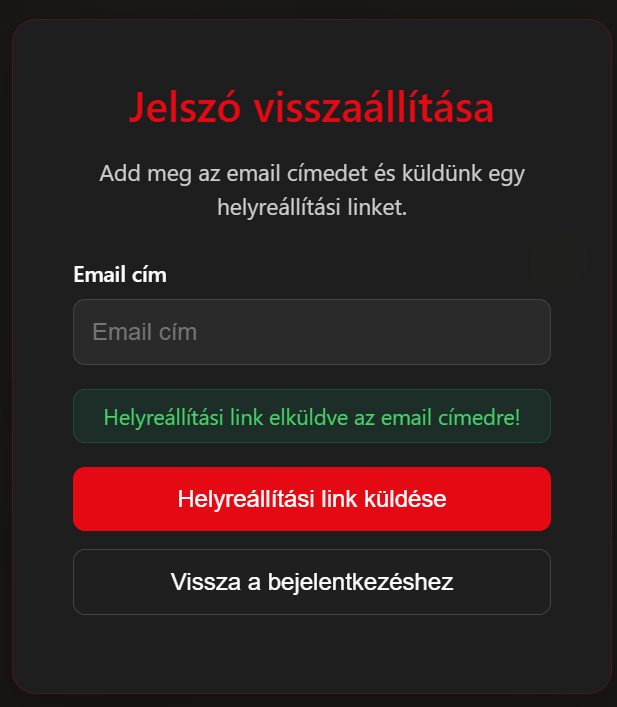
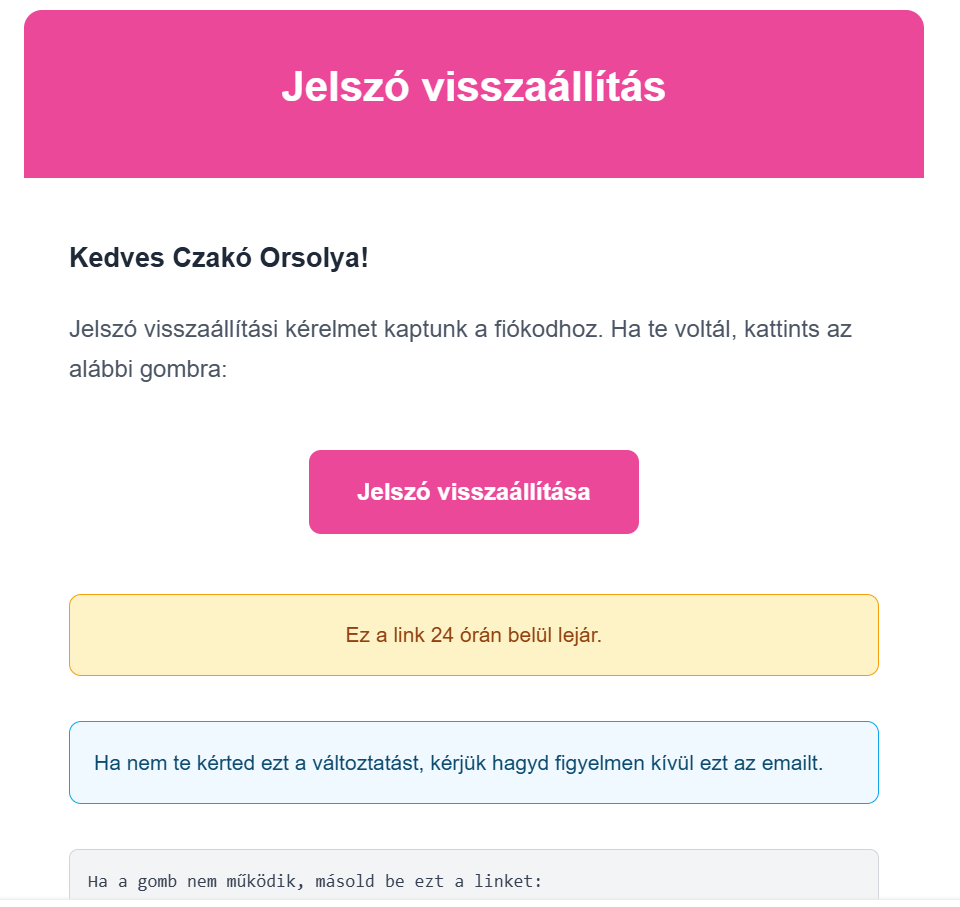
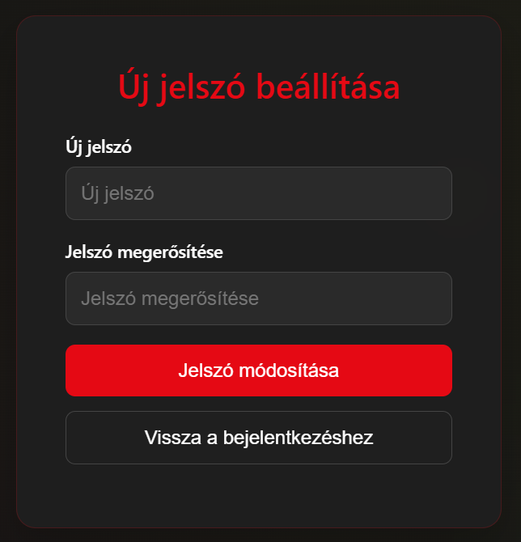
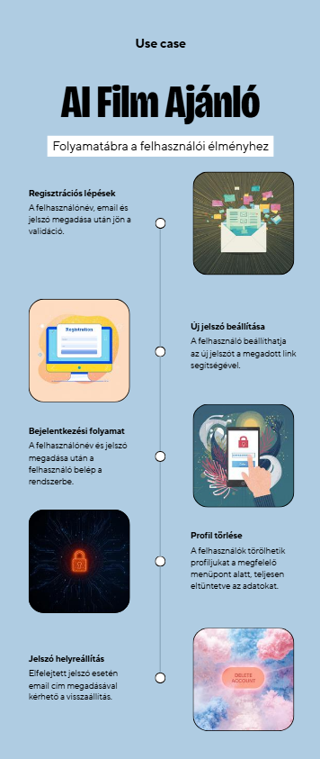

# Autentikáció és Biztonsági Rendszer

## Áttekintés

Az alkalmazás JWT alapú autentikációs rendszert használ a felhasználói fiókok kezeléséhez. A jelszavak bcrypt hash algoritmussal vannak titkosítva az adatbázisban. A rendszer támogatja a regisztrációt, bejelentkezést, jelszó-visszaállítást és profil kezelést.

## Regisztráció

A regisztrációs folyamat során a felhasználó megadja a felhasználónevét, email címét, teljes nevét és jelszavát. A frontend validálja az email formátumát és a jelszó erősségét.

### Backend feldolgozás

A rendszer először ellenőrzi, hogy a felhasználónév és email cím egyedi-e az adatbázisban. Ha valamelyik már létezik, hibaüzenetet ad vissza. Egyedi adatok esetén a jelszót bcrypt algoritmussal hash-eli, majd elmenti az új felhasználót a PostgreSQL adatbázisba.

### Jelszó biztonság

A jelszavak bcrypt hash algoritmussal vannak titkosítva tárolás előtt. A bcrypt egy egyirányú hash függvény, amely automatikusan egyedi salt értéket generál minden jelszóhoz. Ez gyakorlatilag lehetetlenné teszi a jelszó visszafejtését, még azonos jelszavak esetén is különböző hash-ek keletkeznek.

## Bejelentkezés

A felhasználó a felhasználónevével és jelszavával jelentkezhet be. A backend megkeresi a felhasználót az adatbázisban, majd bcrypt segítségével összehasonlítja a megadott jelszót a tárolt hash-sel.

### JWT token generálás

Sikeres bejelentkezés esetén a rendszer JWT tokent generál, amely tartalmazza a felhasználó azonosítóját és email címét. A token egy titkos kulccsal van aláírva, amelyet csak a szerver ismer. A token lejárati ideje hét nap.

A generált tokent és a felhasználó alapadatait a backend visszaküldi a kliensnek, amely elmenti azokat a böngésző localStorage-ába későbbi használatra.

## Munkamenet kezelés

### Token tárolás és használat

A frontend a kapott JWT tokent és a felhasználó adatait a böngésző localStorage-ában tárolja. Minden védett API híváshoz automatikusan hozzáadja a tokent az Authorization header-ben Bearer token formátumban.

### Automatikus bejelentkezés

Az alkalmazás indulásakor ellenőrzi, hogy létezik-e érvényes token a localStorage-ban. Ha igen, automatikusan bejelentkezteti a felhasználót anélkül, hogy újra kellene adnia a bejelentkezési adatait. A token dekódolásával ellenőrzi annak lejáratát is.

### Token validáció a backend oldalon

A backend auth middleware minden védett endpoint hívásnál ellenőrzi a token jelenlétét és érvényességét. Ha a token hiányzik vagy érvénytelen, a kérést 401-es vagy 403-as hibakóddal utasítja el. Érvényes token esetén a dekódolt felhasználói adatokat hozzáfűzi a kéréshez, így a további feldolgozás során elérhető a bejelentkezett felhasználó azonosítója.

## Jelszó visszaállítás

A felhasználó elfelejtett jelszó esetén megadhatja az email címét, amelyre a rendszer visszaállítási linket küld.

### Token generálás és email küldés

A backend egy egyedi, véletlenszerű tokent generál, amelyet hash-elve elment az adatbázisban a felhasználó rekordjához egy lejárati időponttal együtt. A lejárati idő 24 óra. Ezután elküld egy emailt a megadott címre, amely tartalmazza a visszaállítási linket a tokennel.

Biztonsági okokból a rendszer mindig sikeres választ ad, még akkor is, ha az email cím nem létezik az adatbázisban. Ez megakadályozza, hogy támadók kideríthessék, mely email címek vannak regisztrálva.

### Új jelszó beállítása

A visszaállítási linken keresztül a felhasználó megadhatja az új jelszavát. A backend ellenőrzi a token érvényességét és lejáratát. Ha minden rendben, az új jelszót bcrypt-tel hash-eli és elmenti, majd törli a visszaállítási tokent az adatbázisból. Ezután a felhasználót átirányítja a bejelentkezési oldalra.

## Kijelentkezés

A kijelentkezés során a rendszer törli a JWT tokent és a felhasználói adatokat a localStorage-ból, majd átirányítja a felhasználót a bejelentkezési oldalra. Mivel a JWT token stateless, nincs szükség szerver oldali session törlésre. A token automatikusan lejár hét nap után.

## Útvonal védelem

A Vue Router navigation guard-ok védik a privát oldalakat. Minden navigáció előtt ellenőrzi, hogy a cél oldal hozzáférése megköveteli-e az autentikációt. Ha igen és nincs érvényes token, a felhasználót átirányítja a bejelentkezési oldalra. Fordítva, ha valaki már be van jelentkezve és a login oldalra próbál menni, automatikusan a dashboard-ra kerül.

A védett oldalak közé tartozik a dashboard, preferences, profile, settings és favorites oldal.

## API kérések kezelése

Az API service automatikusan hozzáadja a JWT tokent minden backend kéréshez az Authorization header-ben Bearer token formátumban. Ha a szerver 401-es hibakóddal válaszol, ami érvénytelen vagy lejárt tokent jelez, a rendszer törli a localStorage tartalmát és átirányítja a felhasználót a bejelentkezési oldalra.

## Profil kezelés

A bejelentkezett felhasználó megtekintheti és szerkesztheti profil adatait, beleértve a teljes nevét, email címét és bio leírását. A profil frissítése során a rendszer ellenőrzi a felhasználó azonosítóját és elmenti a módosításokat az adatbázisban.

### Jelszó megváltoztatása

A felhasználó megváltoztathatja jelszavát a profilbeállításokban. Ehhez meg kell adnia a jelenlegi jelszavát ellenőrzés céljából, majd az új jelszót kétszer. A backend bcrypt segítségével ellenőrzi a jelenlegi jelszót, és csak helyes jelszó esetén engedi az új jelszó beállítását.

### Fiók törlése

A felhasználó törölheti a fiókját a beállítások menüből. A törlés során az adatbázis CASCADE beállításai miatt automatikusan törlődnek a kapcsolódó adatok is, mint a film interakciók, watchlist elemek, preferenciák és beállítások.

## Biztonsági megoldások

A rendszer több biztonsági réteget alkalmaz:

A jelszavak bcrypt hash-eléssel vannak védve, amely egyirányú titkosítást biztosít. SQL injection támadások ellen a Sequelize ORM parameterizált lekérdezései védenek. A Vue keretrendszer automatikus HTML escapinget alkalmaz az XSS támadások ellen.

A JWT token alapú autentikáció stateless, így CSRF támadásoknak kevésbé kitett. A tokenek titkos kulccsal vannak aláírva, amely csak a szerver ismeri.

## Hibaüzenetek

A rendszer különböző hibaüzeneteket ad vissza a felhasználónak a probléma típusától függően. Érvénytelen vagy hiányzó token esetén 401-es hibakódot ad vissza. Létező felhasználónév vagy email regisztrációkor hibaüzenetet eredményez. A frontend magyar és angol nyelvű visszajelzéseket jelenít meg a művelet eredményétől függően.

## Use case:

