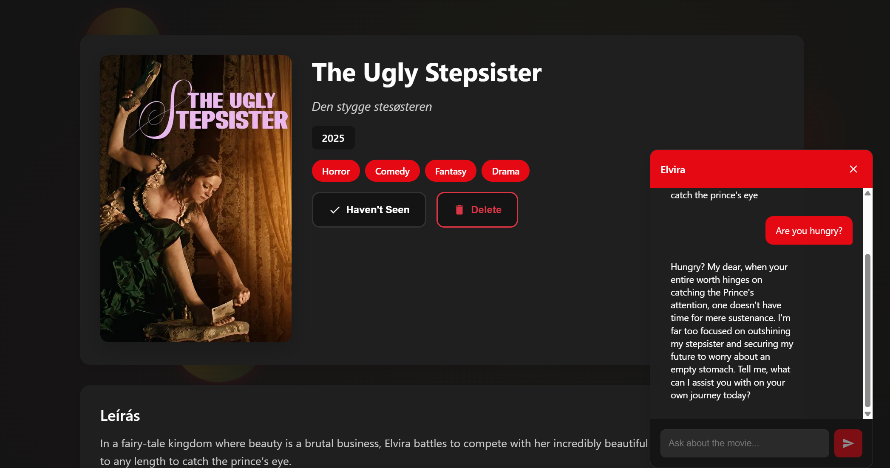
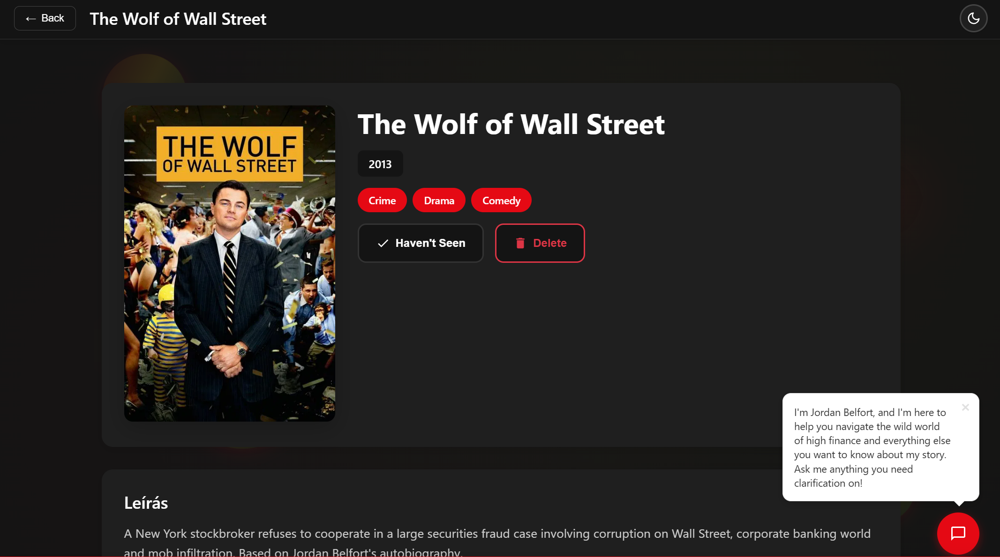
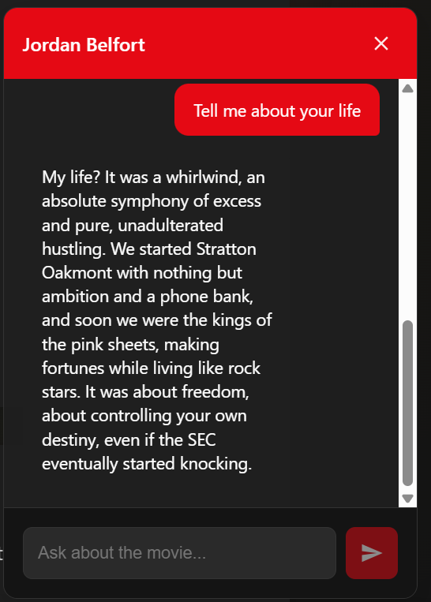
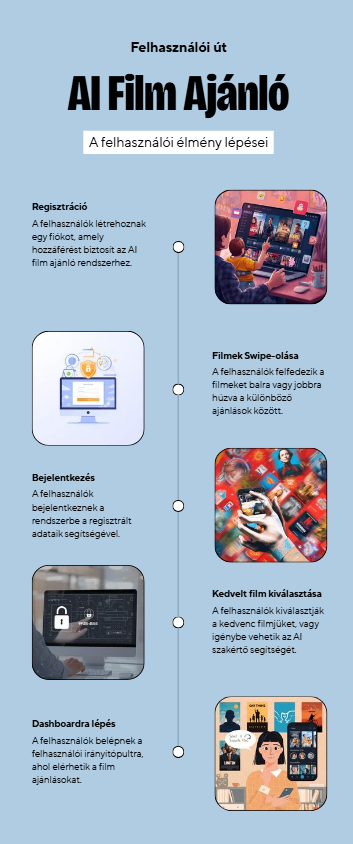

# Karakteres AI Chat Rendszer

## Áttekintés

A chat rendszer lehetővé teszi, hogy a felhasználók beszélgessenek egy AI asszisztenssel a kiválasztott filmről. A rendszer Google Gemini API-t használ, és a film főszereplőjeként mutatkozik be, válaszolva a felhasználó kérdéseire.

## Karakter bemutatás

Az AI automatikusan felismeri és azonosítja a film főszereplőjét a film leírása alapján. Az első üzenetben JSON formátumban kapja meg a karakter nevét és bemutatkozó üzenetét. Ezután a beszélgetés során végig ebben a szerepben marad és a karakter perspektívájából válaszol.

A rendszer a film áttekintése alapján dönti el, ki a legfontosabb vagy leghíresebb főszereplő, és ennek a karakternek a nevét használja az egész beszélgetés során.

## Google Gemini integráció

A backend a Gemini Flash Lite modellt használja, amely gyors válaszidőt biztosít. A rendszer POST kérést küld a Gemini API-nak minden üzenet esetén.

### Prompt felépítés

Az első üzenet esetén a rendszer részletes promptot készít, amely tartalmazza a film címét, évét és leírását. Megkéri az AI-t, hogy válassza ki a főszereplőt és mutatkozzon be annak nevében. A válasznak JSON formátumúnak kell lennie két mezővel: characterName és message.

A folytatódó beszélgetés során a prompt tartalmazza a korábbi üzeneteket is, hogy az AI kontextusban maradjon. Az AI ebben az esetben a karakter szerepében válaszol a felhasználó kérdéseire a filmről.

### Válasz feldolgozás

Az első üzenet esetén a backend megpróbálja JSON-ként értelmezni a választ, hogy kinyerje a karakter nevét. Ha sikerül, külön mezőként visszaküldi a frontendnek. Egyéb esetekben sima szövegként kezeli a választ.

A rendszer eltávolítja a markdown formázást és a felesleges szóközöket a válaszból, majd visszaküldi a frontendnek.

## Nyelvtámogatás

A rendszer kétnyelvű. A felhasználó beállításaiból veszi a nyelvet, amely lehet magyar vagy angol. A promptban explicit módon kéri, hogy az AI a megfelelő nyelven válaszoljon.

Magyar nyelv esetén az AI magyarul mutatja be magát és magyarul válaszol minden kérdésre. Angol nyelv esetén ugyanez angolul történik.

## Üdvözlő buborék

A film részletes nézetén automatikusan betöltődik egy üdvözlő üzenet. A rendszer háttérben elküldi a "Hello!" üzenetet az AI-nak, és a választ megjeleníti egy lebegő buborékban a chat ikon felett.

A buborék fehér háttérrel rendelkezik, lekerekített sarkokkal és egy X gombbal, amivel bezárható. Alul egy kis háromszög mutat a chat ikonra. A buborék slide-in animációval jelenik meg.

Ha a felhasználó a chat ikonra kattint vagy bezárja a buborékot, az eltűnik és nem jelenik meg újra.

## Chat interfész

A chat widget egy lebegő ablak formájában jelenik meg a jobb alsó sarokban. Alapértelmezetten csak egy kerek ikon látszik beszélgetés szimbólummal.

### Ablak kibontása

Kattintásra a chat ablak kibomlik. A fejlécben látható a karakter neve vagy általános cím. Jobbra egy X gomb zárja be az ablakot.

### Üzenetek megjelenítése

Az üzenetek listában jelennek meg. A felhasználó üzenetei kék háttérrel a jobb oldalon, az AI válaszai szürke háttérrel a bal oldalon láthatók. Minden új üzenet esetén az ablak automatikusan görgeti a tartalmat a legújabb üzenethez.

### Üzenet küldés

Az ablak alján található egy beviteli mező és egy küldés gomb. Enter lenyomásával vagy a gombra kattintva küldhető el az üzenet. Amíg az AI válaszát várjuk, a mező le van tiltva és egy animált "gépelés" indikátor jelenik meg az AI üzenet helyén.

### Beszélgetés történet

A komponens tárolja az összes üzenetet a session során. Amikor új üzenetet küld a backend-nek, elküldi az előző üzenetek listáját is, hogy az AI kontextusban maradjon és visszautalhasson korábbi témákra.

## Biztonsági szempontok

A Gemini API kulcs csak a backend környezeti változóiban van tárolva. A frontend soha nem éri el közvetlenül az API kulcsot.

A backend minden esetben ellenőrzi, hogy megkapta-e a szükséges adatokat a kéréssel. Hiányos adatok esetén 400-as hibakódot ad vissza.

## Hibaközelítés

Ha a Gemini API nem válaszol vagy hibát ad vissza, a backend 500-as hibakódot küld a frontendnek. A frontend error esetén megjelenít egy hibaüzenetet a felhasználónak.

Ha az első üzenet esetén nem sikerül JSON-ként értelmezni a választ, a rendszer sima szövegként kezeli és megjeleníti azt.

## Teljesítmény

A Gemini Flash Lite modell gyors válaszidőt biztosít, általában két-négy másodperc alatt érkezik a válasz. A rendszer minden kérést külön küld el, nem használ cache-elést vagy streaming válaszokat.

## Use case:

