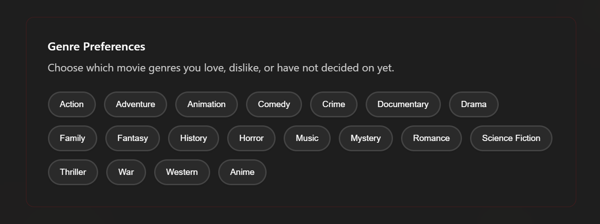
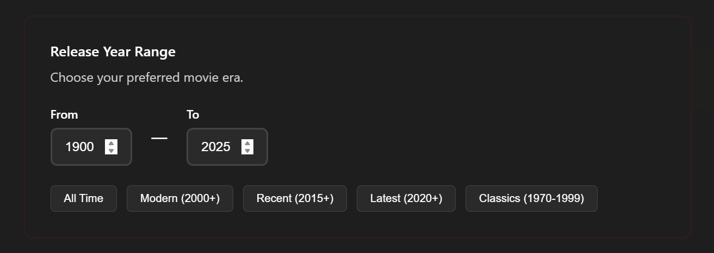
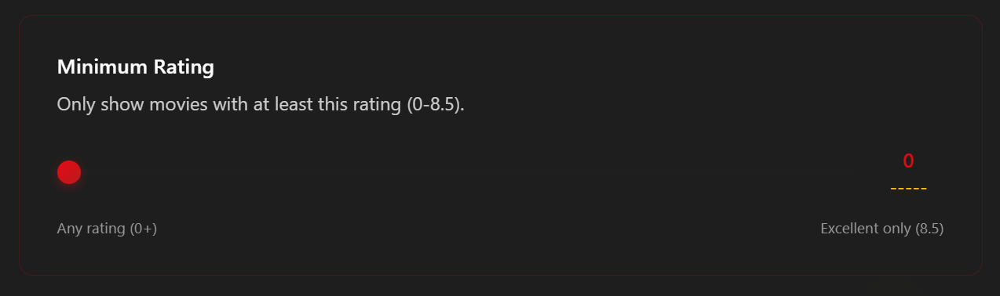
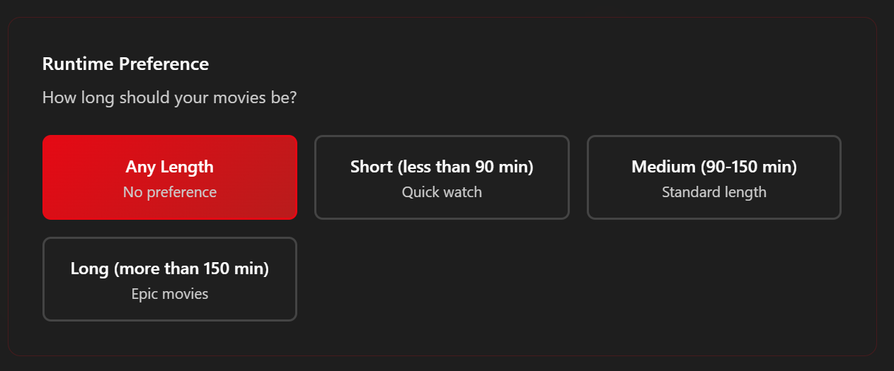

# Film Preferencia Rendszer

## Áttekintés

A preferencia rendszer lehetővé teszi a felhasználók számára, hogy részletesen meghatározzák film ízlésüket és preferenciáikat. Ezek a beállítások befolyásolják a személyre szabott film ajánlásokat és a felfedezési élményt.

## Műfaj Preferenciák

A rendszer 19 különböző filmműfaj kezelését támogatja, ahol minden műfajhoz három különböző értéket lehet beállítani:

- **Pozitív (1)**: Aktívan előnyben részesíti ezt a műfajt
- **Semleges (0)**: Nem befolyásolja az ajánlásokat  
- **Negatív (-1)**: Kerüli ezt a műfajt

### Támogatott Műfajok

- Akció (Action)
- Kaland (Adventure)
- Animáció (Animation)
- Vígjáték (Comedy)
- Krimi (Crime)
- Dokumentumfilm (Documentary)
- Dráma (Drama)
- Családi (Family)
- Fantasy
- Történelmi (History)
- Horror
- Zene (Music)
- Rejtély (Mystery)
- Romantikus (Romance)
- Sci-Fi (Science Fiction)
- Thriller
- Háborús (War)
- Western
- Anime (speciális kategória)



## Időszak Beállítások

A felhasználók meghatározhatják, hogy melyik időszakból szeretnének filmeket:

- **Minimális év**: Legkorábbi kiadási év (alapértelmezett: 1900)
- **Maximális év**: Legkésőbbi kiadási év (alapértelmezett: jelenlegi év)

### Korszak Presetek

- **Összes idő**: Korlátlan hozzáférés minden korszakhoz
- **Klasszikus** (1900-1980): Klasszikus filmek korszaka
- **Modern** (1981-2010): Modern filmkészítés időszaka
- **Legújabb** (2011-től): Kortárs filmek



## Minőségi Szűrők

### Értékelési Küszöb

- **Tartomány**: 0.0 - 10.0
- **Alapértelmezett**: 0.0
- **Forrás**: TMDB közösségi értékelések



A rendszer csak azokat a filmeket ajánlja, amelyek elérnek egy bizonyos minimális értékelést.

### Filmhossz Preferenciák

Négy kategória közül lehet választani:

- **Rövid**: 90 perc alatt (gyors filmek)
- **Közepes**: 90-150 perc (standard hosszúság)
- **Hosszú**: 150 perc felett (epikus alkotások)
- **Bármi**: Nincs hosszúsági korlátozás




## Adatbázis Struktúra

A preferenciák a `user_preferences` táblában tárolódnak, amely tartalmazza:

- Minden műfaj preferencia értéke (-1, 0, 1)
- Időszak határok (min_year, max_year)
- Minőségi beállítások (min_rating)
- Futásidő preferencia (runtime_preference)
- Preferált nyelvek listája
- Korszak preferenciák (prefer_classic, prefer_modern, prefer_recent)

## API Végpontok

### Preferenciák Lekérése
```
GET /api/preferences/:userId
```

### Preferenciák Mentése
```
POST /api/preferences/:userId
```

### Preferenciák Frissítése
```
PUT /api/preferences/:userId
```

## Használat az Ajánlási Rendszerben

A PreferencesController betölti a felhasználó aktuális preferenciáit és használja őket a TMDB API lekérdezések során:

1. Műfaj szűrés pozitív preferenciák alapján
2. Kiadási dátum szűrés az év tartomány szerint
3. Értékelési küszöb alkalmazása
4. Futásidő korlátozás

## Felhasználói Felület

A PreferencesView.vue komponens biztosítja az interaktív felületet:

- Műfaj kiválasztó gombok három állapottal
- Csúszka az év tartomány beállításához
- Értékelési küszöb csúszka
- Futásidő választó gombok

A felület magyar és angol nyelven is elérhető az aktuális lokalizációs beállítás szerint.
