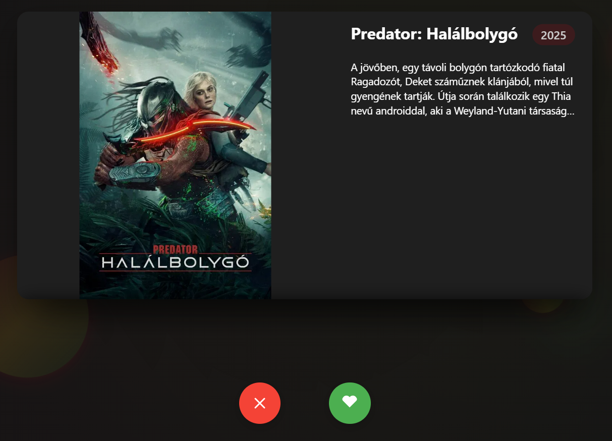
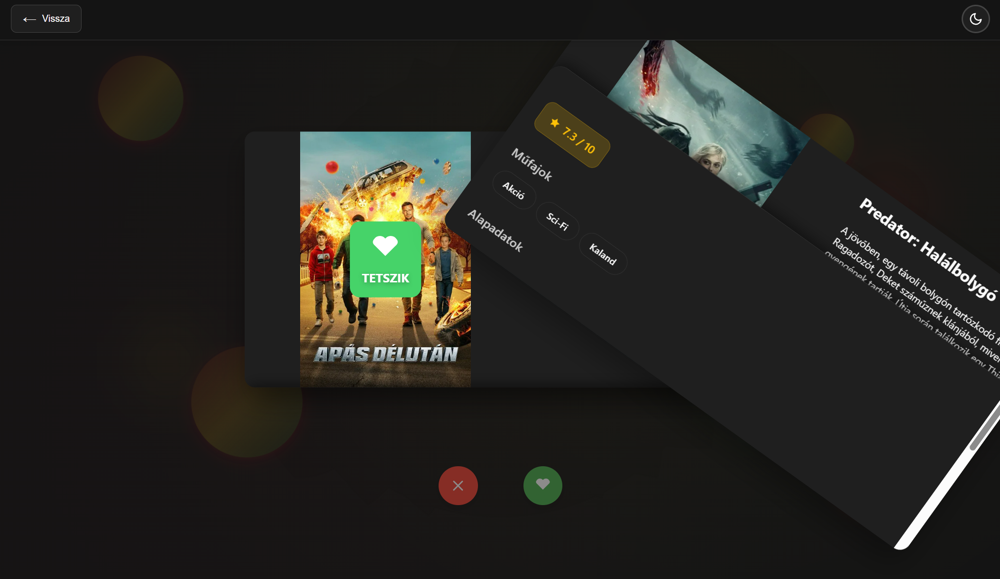
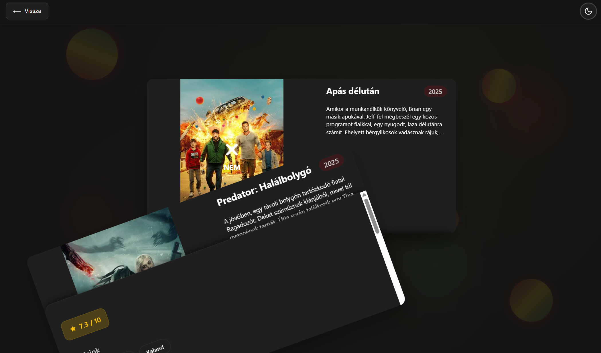
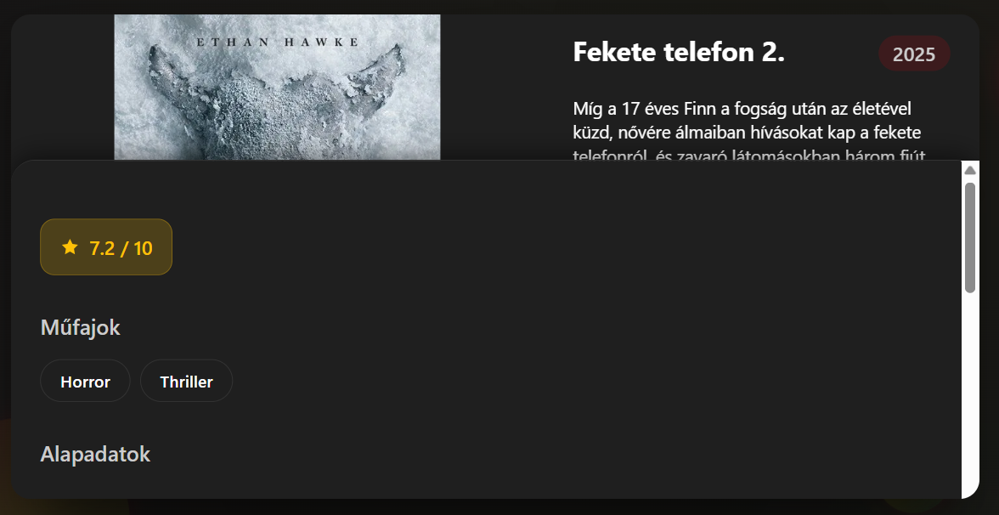
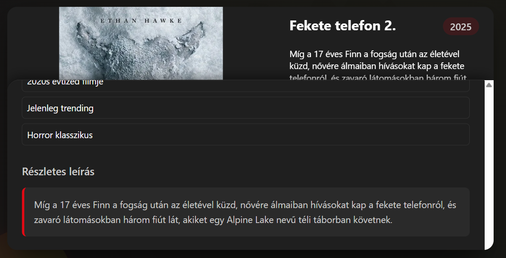

# Swipe Filmválasztás (Tinder-szerű)

## Áttekintés

A swipe alapú filmválasztási rendszer intuitív módot biztosít a filmek felfedezésére és gyors döntéshozatalra. A felhasználók egyszerűen jobbra vagy balra húzhatják a film kártyákat, hogy jelezzék érdeklődésüket vagy érdektelenségüket.

## Működési Mechanizmus

### Swipe Irányok

- **Jobbra Swipe**: Kedvelem ezt a filmet → Hozzáadás a kedvencekhez
- **Balra Swipe**: Nem érdekel → Film elvetése

### Kártya Animációk

A rendszer vizuális visszajelzést ad a swipe műveletekhez:

- Jobbra húzáskor zöld highlight és pozitív animáció
- Balra húzáskor vörös highlight és negatív animáció
- Smooth átmenetek az új film megjelenésekor
- Visszahúzás esetén a kártya visszaugrik eredeti pozíciójába
  


## Film Lekérdezés

A MovieBrowsingView.vue komponens több forrásból tölt be filmeket:

1. **Személyre Szabott Ajánlások**: A felhasználó preferenciái alapján
2. **Népszerű Filmek**: Ha nincs elegendő személyre szabott tartalom
3. **Véletlen Filmek**: További tartalom feltöltéshez

### Előre Töltés

A rendszer előre betölt következő filmeket a zökkenőmentes élmény érdekében. Amikor a felhasználó swipe-ol, a háttérben már töltődik a következő film.

## Adatbázis Interakció

### Kedvenc Film Hozzáadása

Jobbra swipe esetén:
```
POST /api/interactions/:userId/:movieId
Body: { interactionType: "favorite" }
```

A rendszer rögzíti az interakciót a `user_movie_interactions` táblában:
- `user_id`: Felhasználó azonosítója
- `movie_id`: Film TMDB azonosítója
- `interaction_type`: "favorite"
- `created_at`: Időbélyeg



### Film Elvetése

Balra swipe esetén a film egyszerűen átugrik a következőre, de nem kerül rögzítésre az adatbázisban. Ez lehetővé teszi, hogy később újra találkozzon vele a felhasználó.



## Film Információ Megjelenítés

Minden kártyán megjelenik:

- Film poszter nagy felbontásban
- Film címe
- Kiadási év
- Értékelés csillagokkal (TMDB alapján)
- Rövid leírás/cselekmény
- Műfajok listája
- Futásidő




## Érintés és Egér Támogatás

A rendszer támogatja mind az érintő képernyőt, mind az egér használatát:

### Érintőképernyő
- Touch start: Swipe kezdete
- Touch move: Kártya követi az ujjat
- Touch end: Swipe befejezése és kiértékelés

### Egér
- Mouse down: Húzás kezdete
- Mouse move: Kártya mozgatása
- Mouse up: Húzás befejezése

### Billentyűzet
- Jobbra nyíl: Kedvencekhez ad
- Balra nyíl: Elvet

## Swipe Detektálás

A rendszer intelligensen detektálja a swipe gesztusokat:

- **Minimális távolság**: 100px mozgás szükséges a swipe-hoz
- **Küszöbérték**: 50% kártya szélesség a döntéshez
- **Gyorsaság**: Gyors swipe esetén kisebb távolság is elég

## Vizuális Feedback

### Húzás Közben
- Kártya elfordul a húzás irányába
- Átlátszóság változik a távolság függvényében
- Színes árnyék jelenik meg (zöld/vörös)

### Döntés Után
- Gyors kilökés animáció
- Következő kártya smooth becsúszása
- Loading állapot következő film betöltésekor

## Hiba Kezelés

A rendszer kezel különböző hibás eseteket:

- **Nincs több film**: Megjelenít egy "elfogytak a filmek" üzenetet újratöltés opcióval
- **Hálózati hiba**: Retry mechanizmus automatikus újrapróbálkozással
- **Betöltési hiba**: Továbblép a következő filmre
- **API timeout**: Visszacsatol népszerű filmekre

## Teljesítmény Optimalizáció

- Képek lazy loading-ja
- Csak a látható kártya renderelése teljesen
- Debounce a gyors swipe-oknál
- Memória felszabadítás használt kártyák után

## Magyar Lokalizáció

A swipe felület teljesen magyar nyelven is elérhető:
- "Húzd jobbra, ha tetszik"
- "Húzd balra, ha nem érdekel"
- "Elfogytak a filmek!"
- "Töltsd újra a listát"

## Felhasználói Élmény

A swipe mechanizmus gyors és szórakoztató módot biztosít:
- Azonnali döntéshozatal
- Játékos interakció
- Gyors felfedezés
- Minimális kattintás szükséges
